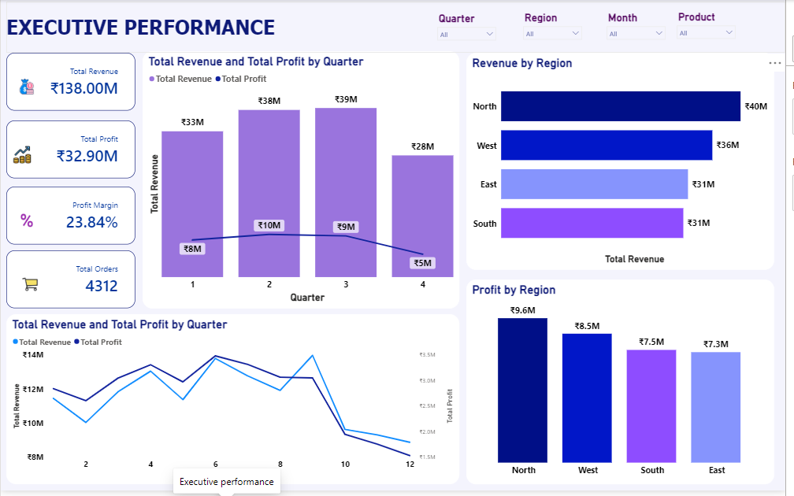
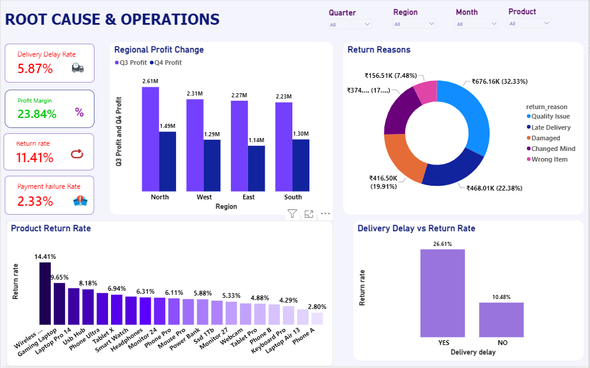
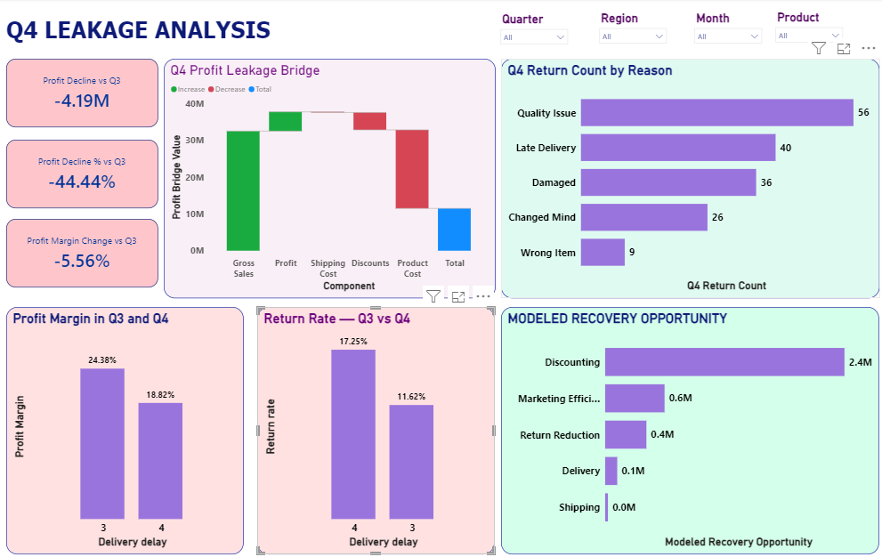

NovCart — AI-Powered Revenue Leakage & Root-Cause Intelligence Platform

An end-to-end e-commerce analytics and Agentic AI platform for identifying revenue leakage, diagnosing business performance deterioration, and supporting data-driven management decisions.

📌 Project Overview

NovCart is a fictional multi-category e-commerce business that experienced a significant deterioration in financial performance, particularly from Q3 to Q4.

The project was built to answer a central business question:

Why did NovCart's profitability deteriorate, where is the business leaking value, and which areas provide measurable recovery opportunities?

The solution combines:

Python for exploratory and statistical analysis
SQL for analytical querying and business investigation
Power BI for executive dashboards
Semantic/business metric layer for consistent KPI definitions
Agentic AI for natural-language business questions
Streamlit for the interactive AI analyst application
Gemini for natural-language reasoning over validated business context

The AI agent is explicitly designed to answer using the supplied business context rather than inventing unsupported numbers.

🎯 Business Problem

NovCart's Q4 performance deteriorated significantly.

Financial deterioration
Metric	Q3	Q4	Change
Revenue	₹3.86 Cr	₹2.78 Cr	−28.03%
Profit	₹94.23 L	₹52.36 L	−44.44%
Profit Margin	24.38%	18.82%	−5.56 pp

The disproportionate decline in profit compared with revenue suggested that NovCart's problem was not simply declining sales.

The project therefore investigated:

Regional profitability
Revenue and profit trends
Delivery delays
Product returns
Return reasons
Payment failures
Discounting
Marketing efficiency
Profit leakage
Modeled recovery opportunities
🔎 Key Findings
1. Profit deteriorated faster than revenue

Revenue declined by approximately 28%, while profit declined by approximately 44%.

This indicates substantial pressure on profitability in addition to the sales decline.

2. Regional profit deterioration

The regional analysis showed substantial Q3-to-Q4 profit declines.

The largest absolute decline in the validated regional comparison was observed in East:

Q3 Profit → ₹22.71 L
Q4 Profit → ₹11.43 L

Decline → ₹11.28 L

North also experienced a major decline:

Q3 Profit → ₹26.15 L
Q4 Profit → ₹14.95 L

Decline → ₹11.20 L

The agent calculates regional Q3/Q4 revenue, profit and profit margin directly from the dataset.

3. Delivery delays were an important operational signal

The analysis identified substantial delivery-delay problems, particularly in the West region.

The project also investigated the relationship between delivery delays and returns.

Importantly:

Statistical association was not treated as proof of causation.

The agent's governance rules explicitly prevent it from claiming that delivery delays caused returns unless causal evidence exists.

4. Returns were a significant leakage area

Return performance was investigated by:

Region
Quarter
Product
Return reason
Delivery status

This allowed the analysis to move from:

"Returns are high"

to:

"Which products, regions and operational conditions are associated with the highest return rates?"

5. Product-level return hotspots

Wireless Earbuds emerged as a notable product-level return hotspot.

This creates an investigation area around:

Product quality
Customer expectations
Product information
Delivery experience
Damage during fulfillment
6. Payment failures

Payment failure rate was included as an operational KPI.

The semantic layer defines payment failure rate as:

Failed Payments / Total Payments

and supports analysis by month, quarter and payment method.

7. Discounting created a major modeled opportunity

The project modeled potential recovery opportunities across several drivers.

The largest modeled opportunity was associated with discounting.

The project deliberately labels these as:

Modeled Opportunities

rather than confirmed financial losses.

The agent's financial governance explicitly prevents modeled opportunities from being represented as audited losses, confirmed leakage, realized savings or guaranteed recovery.

💰 Modeled Recovery Opportunities

The project modeled opportunities across:

Driver	Modeled Opportunity
Discount Recovery	₹24.48 L
Marketing Efficiency	₹6.08 L
Return Reduction	₹4.22 L
Delivery Recovery	₹1.24 L
Shipping Cost Recovery	₹0.29 L

These are scenario/model outputs, not guaranteed savings.

Because multiple drivers can overlap, the individual opportunities should not automatically be summed and treated as realized recoverable profit.

🐍 Python Analysis

Python was used as the primary analytical environment for:

Data validation
Exploratory data analysis
KPI analysis
Revenue/profit analysis
Regional analysis
Return analysis
Delivery analysis
Payment analysis
Marketing analysis
Statistical analysis
Leakage identification
Recovery scenario modeling

The resulting validated analysis was stored as structured business context for the AI agent.

🗄️ SQL Analysis

SQL was used to reproduce and investigate business questions using analytical queries.

The SQL work focused particularly on:

CTEs
Window functions
LAG()
Aggregations
Subqueries
Regional comparisons
Quarter-over-quarter analysis
Monthly revenue changes
Profit changes
Business KPI calculations

For example, a month-over-month revenue decline can be investigated using:

LAG()

to compare the current month's revenue with the previous month.

This provides a more production-oriented analytical workflow than relying only on Python.

📊 Power BI Dashboard

The Power BI solution was designed as a three-page business story.

Page 1 — Executive Performance

Purpose:

What happened to NovCart's overall business performance?

Key areas:

Total Revenue
Total Profit
Profit Margin
Total Orders
Revenue & Profit by Quarter
Revenue by Region
Profit by Region

This page establishes the overall performance problem.

Total Revenue: ₹138.00M across the full dataset.
Total Profit: ₹32.90M.
Overall Profit Margin: 23.84%.
Total Orders: 4,312.
Revenue increased from Q1 through Q3, reaching approximately ₹39M in Q3.
Q4 revenue dropped sharply to approximately ₹28M.
Profit followed a similar pattern but experienced a more severe Q4 decline.
Q3 generated approximately ₹94.23L profit, compared with ₹52.36L in Q4.
Therefore, Q4 profit declined by approximately ₹41.87L / 44.44% compared with Q3.
Revenue declined by approximately 28.03%, meaning profit deteriorated faster than revenue.
North generated the highest overall revenue at approximately ₹40M.
North also generated the highest overall profit at approximately ₹9.6M.
The regional results show that the Q4 deterioration was not isolated to one region.
The page establishes the main business problem: NovCart entered Q4 with significant pressure on both sales and profitability.

Page 2 — Root Cause & Operations

Purpose:

What operational signals are associated with the deterioration?

Key areas:

Delivery Delay Rate
Profit Margin
Return Rate
Payment Failure Rate
Regional Profit Change
Return Reasons
Product Return Rate
Delivery Delay vs Return Rate

This page moves from what happened to where the operational pressure exists.

Overall Delivery Delay Rate: 5.87%.
Overall Return Rate: 11.41%.
Payment Failure Rate: 2.33%.
Profit Margin: 23.84% for the overall dataset.
Q4 operational performance was worse than the overall business baseline in several areas.
West emerged as an important delivery-delay hotspot, with a substantial increase in delivery delays compared with Q3.
East experienced the largest absolute Q3-to-Q4 profit decline, falling from approximately ₹22.71L to ₹11.43L.
North also experienced a major profit decline, from approximately ₹26.15L to ₹14.95L.
Quality issues represented the largest return category, accounting for approximately 33% of returns.
Damaged products represented another major return category at approximately 21%.
Changed Mind accounted for approximately 20% of returns.
Late Delivery accounted for approximately 18% of returns.
Wrong Item represented approximately 8% of returns.
Wireless Earbuds had the highest product-level return rate, at approximately 14.41%.
The analysis showed a strong difference in return rates between delayed and non-delayed orders:
Delayed orders: 26.61%
Non-delayed orders: 10.48%
This indicates that delivery delay is an important operational signal associated with returns.
However, the analysis does not establish that delivery delays alone cause returns.
The page therefore identifies multiple areas requiring investigation rather than attributing the entire decline to a single cause.

Page 3 — Q4 Leakage Analysis

Purpose:

Where is profitability being lost and what recovery opportunities can be modeled?

Key areas:

Profit Decline vs Q3
Profit Decline %
Profit Margin Change
Q4 Leakage Analysis
Q3 vs Q4 comparison
Return-related leakage
Modeled Recovery Opportunity

This page connects the operational findings to financial impact.

Q4 Profit: ₹52.36L.
Q3 Profit: ₹94.23L.
Profit decline: approximately ₹41.87L.
Profit decline percentage: 44.44%.
Q3 profit margin was approximately 24.38%.
Q4 profit margin fell to approximately 18.82%.
This represents a 5.56 percentage-point deterioration in profit margin.
The key finding is that profitability deteriorated considerably faster than revenue.
The Q4 leakage analysis breaks the profitability problem into different cost and operational drivers.
Discounting was identified as the largest modeled recovery opportunity.
Other modeled opportunities were associated with:
Marketing efficiency
Return reduction
Delivery improvement
Shipping costs
The modeled recovery opportunities should be interpreted as analytical scenarios, not guaranteed savings or audited losses.
Return analysis shows that quality issues, damaged products, and late delivery are important areas behind product returns.
The Q3/Q4 comparison shows that the deterioration was broad rather than being explained by one isolated KPI.
The page connects operational problems from Page 2 with their potential financial impact.

The key management question becomes:

Which leakage drivers should NovCart investigate first to recover profitability?

🤖 Agentic AI System

The project also includes an AI Business Intelligence Agent.

The agent is built around three layers of business knowledge:

┌─────────────────────────────┐
│      Semantic Layer         │
│ Official KPI definitions    │
└──────────────┬──────────────┘
               ↓
┌─────────────────────────────┐
│    Validated Analysis       │
│ Python/statistical findings │
└──────────────┬──────────────┘
               ↓
┌─────────────────────────────┐
│      CSV Data Context       │
│ Detailed business data      │
└──────────────┬──────────────┘
               ↓
        Gemini AI Analyst
               ↓
      Business Answer
Streamlit app:- [https://novcart-ai.streamlit.app/](https://novcart-ai.streamlit.app/)
The code explicitly combines these three layers into BUSINESS_CONTEXT.

🧠 Semantic Layer

The semantic layer ensures that the AI uses consistent business definitions.

For example:

Revenue
SUM(net_revenue)
Profit
SUM(profit)
Profit Margin
SUM(profit) / SUM(net_revenue)
Orders
nunique(order_id)
AOV
SUM(net_revenue) / nunique(order_id)
Return Rate
returned_orders / total_orders
Delivery Delay Rate
delayed_orders / total_orders

These definitions are explicitly encoded in agent.py.

🛡️ AI Governance

A major feature of the agent is analytical governance.

The agent follows this source priority:

1. Validated Analysis
2. Semantic Layer
3. CSV-derived Context
4. Safe Derived Calculations

It is instructed to never invent missing numbers.

It also distinguishes:

FACT
VALIDATED EVIDENCE
MODELED OPPORTUNITY
INTERPRETATION
CAVEAT

This makes the system more suitable for business analytics than a generic chatbot.

🖥️ Streamlit Application

The Agentic AI interface is implemented using Streamlit.

The application provides:

Business-question chat interface
Chat history
Example business questions
KPI overview
AI-generated answers
Business analysis coverage

The application calls:

from agent import ask_agent

and sends user questions to the AI analyst.

Example questions include:

Why did profit decline from Q3 to Q4?

Which region generated the most revenue in Q4?

Which region had the biggest decline in profit?

Which products have high return rates?

Is delivery delay associated with returns?

How much modeled opportunity is associated with discounting?

🏗️ Project Architecture
                         NOVCART
                            │
                            ▼
                    ecommerce_cleaned.csv
                            │
              ┌─────────────┴─────────────┐
              ▼                           ▼
        Python Analysis               SQL Analysis
              │                           │
              ▼                           ▼
     Validated Findings             Business Queries
              │                           │
              └─────────────┬─────────────┘
                            ▼
                    Semantic Layer
                            │
                            ▼
                 Power BI Dashboards
                            │
                            ▼
                 analysis_results.json
                            │
                            ▼
                       agent.py
                            │
             ┌──────────────┴──────────────┐
             ▼                             ▼
        Business Context              Gemini API
             │                             │
             └──────────────┬──────────────┘
                            ▼
                         app.py
                            │
                            ▼
                    Streamlit AI Analyst
